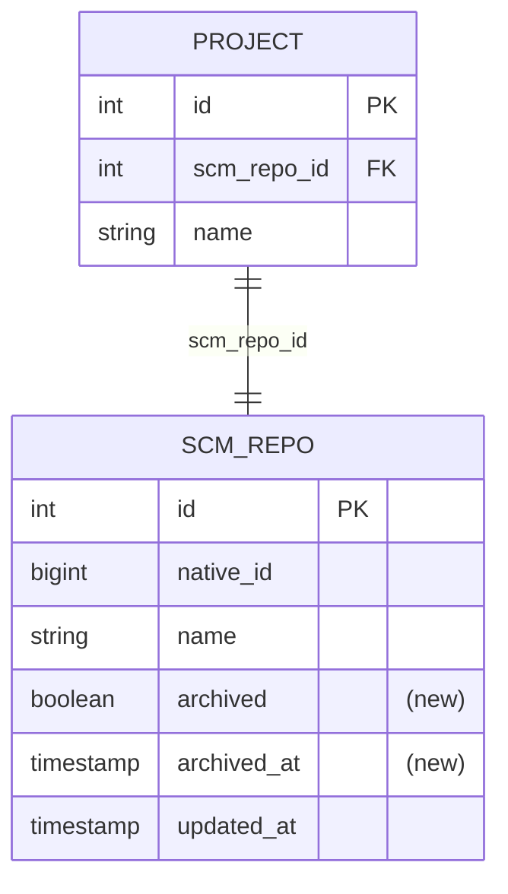

# Spec: Archived Repository Notify

## 1. Goal
Detect when a GitHub repository indexed by klibs.io is archived, expose that state and archive date through the project details API, and show a GitHub-style archived repository notification on the klibs.io project page.

## 2. Problem
- klibs.io currently does not persist or expose whether the backing GitHub repository is archived.
- Users can discover that a project is archived only after leaving klibs.io and opening the GitHub repository.
- Affected: end users evaluating libraries on klibs.io, because archived projects may no longer be maintained; library authors, because an archived status should be represented consistently with the source repository.

## 3. User scenarios & acceptance
### Scenario 1 - Archived project shows a notification (P1)
- **Given:** an indexed klibs.io project whose backing GitHub repository is archived and whose archive date has been indexed.
- **When:** the user opens the project's klibs.io project page.
- **Then:** the page shows a visible archived repository notification near the top of the project content, styled similarly to GitHub's archived repository notice and saying: `This repository was archived by the owner on <date>. It is now read-only.`
- **Independent test:** seed a project details response with `archived = true` and `archivedAtMillis`; render the project page; assert the archived repository notification text and formatted date are visible.

### Scenario 2 - Non-archived project does not show a notification (P1)
- **Given:** an indexed klibs.io project whose backing GitHub repository is not archived.
- **When:** the user opens the project's klibs.io project page.
- **Then:** no archived repository notification is shown.
- **Independent test:** seed a project details response with `archived = false`; render the project page; assert the archived notification is absent.

### Scenario 3 - Existing repository refresh captures archive changes (P1)
- **Given:** a GitHub repository becomes archived after it was already indexed by klibs.io.
- **When:** the automatic GitHub repository metadata refresh successfully updates that repository.
- **Then:** klibs.io persists the archived state and archive date, and the project details API returns them without requiring a manual reindex.
- **Independent test:** seed an existing `scm_repo` row with `archived = false` and `archived_at = null`; mock GitHub to return the same repository as archived with an archive timestamp; run `GitHubIndexingService.updateRepo`; assert the row is updated and the project details response exposes `archived = true` with `archivedAtMillis`.

### Edge cases
- GitHub repository metadata cannot be fetched during refresh -> existing retry/backoff behavior applies; the previously persisted archived value and archive date are retained until a later successful refresh.
- Archive-date lookup fails after the repository metadata fetch says the repository is archived -> the repository remains eligible for retry through the existing update loop; the project page still shows an archived notification when `archived = true`, with date-less fallback copy if no archive date has been persisted yet.
- Newly indexed archived repository -> initial indexing persists `archived = true` and the best available `archived_at`, so the first project details response can expose the notification.
- Archived repository is later unarchived -> the next successful repository metadata refresh persists `archived = false`, clears `archived_at`, and the project page stops showing the notification.

## 4. Functional requirements
- **FR-001:** System MUST persist whether each indexed GitHub-backed SCM repository is archived.
- **FR-002:** System MUST persist the archive timestamp for archived GitHub-backed SCM repositories when GitHub returns it.
- **FR-003:** System MUST update the persisted archived state and archive timestamp during automatic GitHub repository metadata refreshes.
- **FR-004:** System MUST clear the persisted archive timestamp when a previously archived repository is later indexed as not archived.
- **FR-005:** System MUST expose the archived state on the project details API response.
- **FR-006:** System MUST expose the archive timestamp on the project details API response when the backing repository is archived and the timestamp is known.
- **FR-007:** The project page MUST show an archived repository notification when the project details response says the backing repository is archived.
- **FR-008:** The archived repository notification MUST include the archive date when the project details response includes it.
- **FR-009:** The project page MUST NOT show the archived repository notification when the project details response says the backing repository is not archived.
- **FR-010:** After deployment, archived-state changes SHOULD become visible on project pages within approximately one day for almost all indexed repositories, assuming the existing GitHub repository metadata refresh is running successfully.

## 5. Non-functional requirements
- **External rate limits:** Normal archived-state indexing MUST NOT increase GitHub API calls to more than 2x the current repository metadata refresh volume. The target design reads the archived boolean from the existing Kohsuke repository fetch and performs a supplemental GraphQL archive-date lookup only for repositories reported as archived.
- **Observability:** Existing `klibs.github.requests` metrics should remain sufficient to compare call volume before and after the change. Add a separate request type tag for the supplemental archive-date lookup so the call budget can be checked on staging.

## 6. Out of scope
- Filtering or hiding archived repositories in search results or category pages.
- Showing archived status on search result cards or package pages.
- Creating a separate archived-repository indexing job.
- Backfilling archived status with a one-off all-repository batch outside the normal metadata refresh.
- Changing package details pages that happen to show parent project metadata.

## 7. Klibs.io technical surface
- **Modules touched:**
  - `integrations/github` - add `archived: Boolean` and `archivedAt: Instant?` to `GitHubRepository`; map `archived` from `GHRepository.isArchived()`; add a GraphQL-backed lookup for `Repository.archivedAt` only when a repository is archived.
  - `core/scm-repository` - add archived state and archive timestamp to `ScmRepositoryEntity` and repository JDBC mappings.
  - `app` - add an additive Liquibase migration for `scm_repo.archived` and `scm_repo.archived_at`; persist both values during repository indexing and update flows.
  - `core/project` - add archived state and archive timestamp to `ProjectDetails` and `ProjectDetailsDTO`; map them through `ProjectService` and `ProjectController`.
  - `frontend` - add `archived` and `archivedAtMillis` to `ProjectDetails` in `src/app/types.ts`; render the archived notification on `src/app/project/[organization]/[projectName]/project-page-content.tsx`; cover it in project page tests.
- **Database:** Add `scm_repo.archived boolean not null default false` and nullable `scm_repo.archived_at timestamp` in `app/src/main/resources/db/migration/2026-Q2/`. Existing rows default to not archived and are corrected by the rolling repository metadata refresh. Additive-only migration.
- **Persistence style:** Match the existing `core/scm-repository` raw JDBC repository style for `scm_repo` reads/writes.
- **Search / materialized views:** No current `project_index` or `package_index` change. Future archived filtering may require adding archived fields to search projections later.
- **External integrations:** Use existing Kohsuke repository fetches for repository metadata. Use GitHub GraphQL for `Repository.archivedAt` because Kohsuke 1.321 exposes `GHRepository.isArchived()` but does not expose the archive timestamp in `GHRepository`.
- **Scheduled jobs:** Reuse `GitHubRepositoryUpdatingJob`, which currently runs every 30 seconds and updates up to 3 repositories per iteration. No new ShedLock key.
- **API surface:** Additive `archived: boolean` and nullable `archivedAtMillis: long?` fields on `ProjectDetailsDTO`. OpenAPI schema should document both fields. No breaking change.
- **Frontend contract:** `ProjectDetails.archived` is a required boolean. `ProjectDetails.archivedAtMillis` is nullable. `archived = true` means render the archived notification; `archivedAtMillis` controls whether the copy includes a date.

## 8. Design decisions
### Decision - Store archived metadata on `scm_repo`
- **Choice:** Add `archived` and `archived_at` columns to `scm_repo` and carry them through `ScmRepositoryEntity`.
- **Why:** Archived state is a property of the source repository, not of a package or presentation layer. Storing it with other GitHub repository metadata keeps project details mapping simple and supports future search filtering.
- **Rejected:** Compute archived status on every project details request by calling GitHub; this would add latency, increase GitHub API volume, and make project pages depend on live GitHub availability.
- **Revisit if:** klibs.io starts supporting non-GitHub SCM providers with different archive semantics.

### Decision - Use Kohsuke for archived state and GraphQL only for archive date
- **Choice:** Extend the existing `GitHubRepository` integration model with `archived`, mapped from `GHRepository.isArchived()`. When `archived = true`, fetch `Repository.archivedAt` via GitHub GraphQL and store it as `archivedAt`.
- **Why:** The existing repository indexing path already fetches the GitHub repository object for initial indexing and refresh. Reading `isArchived()` preserves the current call pattern for non-archived repositories, while GraphQL provides the archive date needed for GitHub-style copy.
- **Rejected:** Add a GraphQL call for every repository; this would provide a uniform data source but unnecessarily increases API volume for the common non-archived case. Drop the archive date and use a boolean-only notice; this misses the desired GitHub-style message with `{date}`.
- **Revisit if:** Kohsuke exposes archive timestamp in a future library version, or if a single GraphQL query can replace the existing repository metadata fetch without losing fields the current indexing path needs.

### Decision - Date-less fallback when archive date is unavailable
- **Choice:** If `archived = true` but `archivedAtMillis = null`, show `This repository was archived by the owner. It is now read-only.`
- **Why:** Users should still be warned that a repository is archived even if the supplemental date lookup failed or has not run yet.
- **Rejected:** Hide the notification until the exact archive date exists; that would miss the primary warning for some archived repositories.
- **Revisit if:** product review decides incomplete GitHub-style copy is worse than temporarily hiding the warning.

### Decision - Project details only for this version
- **Choice:** Expose archived fields only on the project details API and render only on the dedicated project page.
- **Why:** The requested visible behavior is on the project page. Search filtering is listed as a future development, so changing search result contracts now would broaden the diff.
- **Rejected:** Add archived fields to search result DTOs and `project_index` now; that would help future filtering but is not necessary for the current notification.
- **Revisit if:** the first frontend implementation needs archived state before loading project details, or if filtering becomes part of the same release.

## 9. Key entities
- **`ScmRepositoryEntity`:** add `archived: Boolean` and `archivedAt: Instant?`, sourced from GitHub repository metadata, persisted in `scm_repo`, and exposed through project details.

## 10. Database schema diagram

## 11. Test strategy
- **Unit:** `GitHubIntegrationKohsukeLibrary` model mapping covers `GHRepository.isArchived()` to `GitHubRepository.archived`; GraphQL archive-date lookup parsing covers timestamp present, null, and failed response cases.
- **DB-integration:** `GitHubIndexingServiceUpdateRepoTest` updates `scm_repo.archived` / `scm_repo.archived_at` from false/null to true/timestamp, from true/timestamp to false/null, and persists values during initial repository indexing.
- **Web / smoke:** project details endpoint returns `archived: true` with `archivedAtMillis`, `archived: true` with `archivedAtMillis: null`, and `archived: false`; OpenAPI schema includes both fields.
- **Frontend:** Playwright project page test renders the notification with date for `archived = true` and `archivedAtMillis` present, renders date-less fallback for `archived = true` and no date, and suppresses it for `archived = false`; add a stable selector such as `data-testid="archived-repository-notification"`.
- **Reviewer-only - manual / staging:** On `klibs-features`, open a known archived GitHub-backed project after the repository metadata refresh runs and confirm the notification appears with the archive date; verify GitHub integration request volume stays below 2x the pre-change repository metadata refresh volume.

## 12. Assumptions
- The exact visual styling can be GitHub-inspired rather than pixel-identical.
- A date-less notification is acceptable as a temporary fallback when GitHub archive-date lookup fails, because warning the user is more important than hiding incomplete copy.
- The current repository metadata refresh cadence is the intended mechanism for the "approximately in a day" success criterion.

## 13. References
- GitHub GraphQL Repository fields: `Repository.isArchived` and `Repository.archivedAt` are available in the official GraphQL reference: https://docs.github.com/en/enterprise-cloud@latest/graphql/reference/repos
- GitHub REST repository API / historical change note: repository responses contain an `archived` field; REST does not provide the archive timestamp needed for the GitHub-style date copy: https://developer.github.com/changes/11/
- Kohsuke GitHub API 1.321 source in local Gradle cache: `GHRepository.isArchived()` is available, and no `archivedAt` accessor is present in `GHRepository`.
