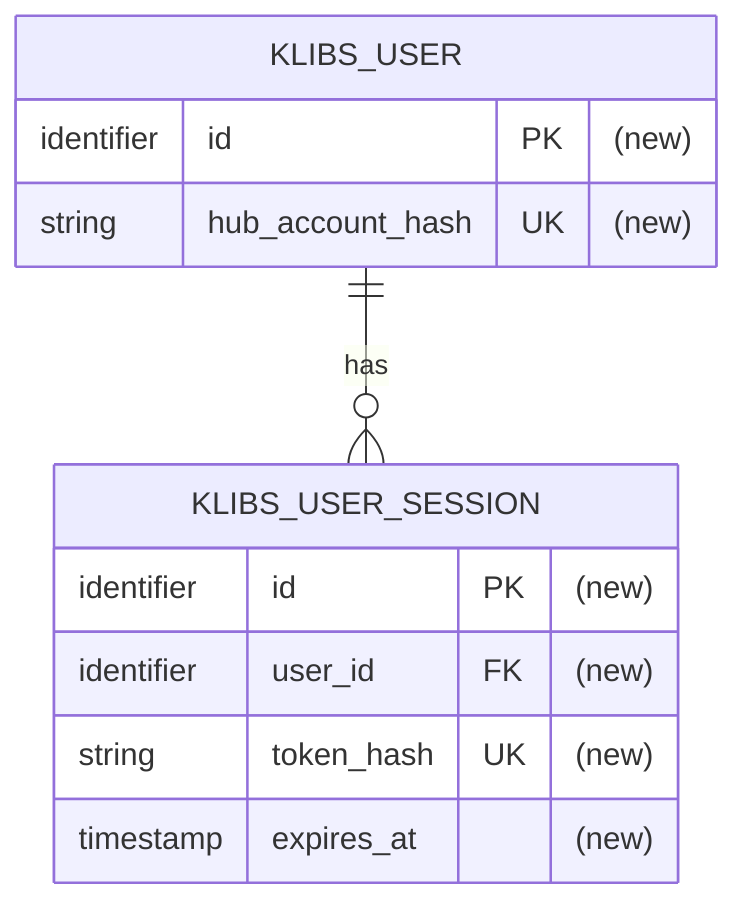

# JetBrains Hub authentication — review spec

Review-ready authentication spec grouped into collapsible sections for focused discussion.

<strong>Review vocabulary</strong>

 

- 

  
<strong>HTTP and API basics</strong>

   

  - **Shared backend data/changes:** data or changes shared beyond the current page, such as DB records, sessions, queued
    jobs, or external service calls.
  - **Endpoint:** backend API method and path, for example `GET /auth/current-user`.
  - **Public endpoint:** endpoint that works without login.
  - **User-only endpoint:** endpoint that needs a signed-in browser user.
  - **Public request:** request to a public endpoint.
  - **Redirect:** HTTP response that tells the browser to open another URL.
  - **Callback:** backend endpoint that the browser opens after Hub finishes login.

  

- 

  
<strong>Sessions and cookies</strong>

   

  - **Basic credentials:** username and password sent in the `Authorization: Basic ...` request header.
  - **Basic auth:** existing operator/admin login using Basic credentials.
  - **Klibs session:** local browser login created after successful Hub login.
  - **Session token:** random secret value created by the backend for a klibs session.
  - **Cookie:** value stored by the browser and automatically sent to matching backend endpoints.
  - **Session cookie:** cookie that carries the session token.
  - **Login attempt:** short-lived data for one browser login flow.
  - **Login cookie:** short-lived cookie for one login attempt.
  - **Cookie flags:** cookie settings: `HttpOnly` (boolean), `Secure` (boolean), `SameSite` (Strict/Lax/None), `Path` (URL
    path), `Max-Age` (duration).
  - **TTL:** time-to-live; how long a temporary value works.

  

- 

  
<strong>OAuth and signed values</strong>

   

  - **Nonce:** random one-time value that makes a login attempt unique.
  - **Signature:** value attached to signed data to prove it was not changed.
  - **HMAC:** function (`message` + `secret key` -> `hash-like value` (`signature`)).
  - **Bearer credential:** secret value that works for whoever has it.
  - **Access token:** short-lived secret value issued by Hub and used by the backend to call Hub APIs.
  - **OAuth code (authorization code):** short-lived value returned by Hub to the callback. The backend exchanges it for an
    access token.
  - **`code_verifier`:** secret random value kept until the token exchange so the backend can prove the same login attempt.
  - **`code_challenge`:** public value derived from `code_verifier` and sent to Hub before login so Hub can verify
    `code_verifier` later.
  - **PKCE:** OAuth protection where the backend sends `code_challenge` before login and later proves the same login attempt
    using `code_verifier`.
  - **OAuth state (state):** value sent to Hub during login and returned on callback to connect the callback to the login
    attempt. `OAuth state` and `state` mean the same value in this spec.
  - **Token exchange:** backend-to-Hub call that exchanges OAuth code plus PKCE proof for an access token.

  

- 

  
<strong>Browser security and responses</strong>

   

  - **Relative `returnTo`:** frontend path without domain, used to return the browser to the right page after login. Example:
    `/project/kizitonwose/Calendar`.
  - **Open redirect:** bug where attacker-provided `returnTo=https://evil.example` makes a trusted site redirect users there.
  - **URL decoding:** converting URL-encoded text back into characters, for example `%2F` into `/`.
  - **Origin:** scheme, host, and port of the page that started a browser request. Example: `https://klibs.io`.
  - **Credentialed browser call:** browser API request that includes cookies or other login data.
  - **Trusted frontend origin:** configured frontend origin allowed for credentialed browser calls. Example: `https://klibs.io`.
  - **CORS:** browser rule that controls whether one origin can call another origin's API.
  - **CSRF:** attack where another site tries to make the browser send a logged-in request.
  - **CSRF gate:** Origin check before logged-in write actions.
  - **Idempotent:** safe to repeat; the final result stays the same.
  - **XSS:** attack where injected JavaScript runs inside the site.

  

<strong>1. Goal</strong>

 

Add sign-in through JetBrains Hub for regular klibs.io users.

After sign-in, klibs.io can assign the browser to a stable local `klibs_user`. This is needed for future features where
the site must know which user performed an action, such as likes, subscriptions, and maintainer permissions.

Existing anonymous browsing and Basic-auth operator/admin flows must keep working as before.

<strong>2. Problem</strong>

 

- Without a stable local `klibs_user`, future features cannot reliably know which regular user liked, subscribed to, or
  maintained something.
- That identity must survive browser sessions and JetBrains Hub re-login, otherwise the same person can look like different
  klibs.io users.
- The production frontend and backend run on different origins (`https://klibs.io` and `https://api.klibs.io`), so a vague
  login design can redirect to the wrong site, send cookies incorrectly, or leave CSRF behavior unclear.
- Affected: regular users signing in from the frontend, developers adding user-owned features, and operators relying on the
  existing Basic-auth endpoints.

<strong>3. User Stories (required reading for reviewers)</strong>

 

`P` means priority: `P1` is required, `P2` is important but less central.

- 

  
<strong>3.1 Anonymous public browsing stays public (P1)</strong>

   

  - **Given:** a request to a public klibs.io API endpoint without Basic credentials and without a klibs session cookie.
  - **When:** the backend receives the request.
  - **Then:** the endpoint returns the existing public/anonymous response and does not require regular-user authentication.
  - **Independent test:** call representative public endpoints from the existing public contract without credentials and
    assert they remain accessible.

  

- 

  
<strong>3.2 Existing Basic auth stays separate (P1)</strong>

   

  - **Given:** a prod-only operator/admin endpoint and valid `Authorization: Basic ...` credentials with the required role.
  - **When:** the backend receives the request, with or without a klibs session cookie.
  - **Then:** the request is authenticated as the Basic-auth operator/admin identity, and the klibs session cookie does not
    grant or change operator/admin roles.
  - **Independent test:** call a Basic-protected endpoint with Basic credentials, with a session cookie, and with both; assert
    Basic auth behavior is unchanged and session-only access does not receive admin/operator roles.

  

- 

  
<strong>3.3 New user signs in with JetBrains Hub (P1)</strong>

   

  - **Given:** a browser user on `https://klibs.io` who is not signed in to klibs.io.
  - **When:** the user starts Hub sign-in, completes the Hub login, and Hub redirects back to the backend callback.
  - **Then:** klibs.io creates a stable local user identity, creates a local session, sets a browser session cookie, and
    redirects the browser back to `https://klibs.io` plus the validated relative `returnTo` path.
  - **Independent test:** run the full OAuth flow against a test Hub server and assert the final redirect, session cookie,
    and `/auth/current-user` response.

  

- 

  
<strong>3.4 Returning user is recognized from an existing session (P1)</strong>

   

  - **Given:** a browser has a klibs session cookie whose token matches a non-expired DB session from a previous login.
  - **When:** the browser opens klibs.io or calls `/auth/current-user`.
  - **Then:** the backend returns `authenticated=true` and the same local `userId`.
  - **Independent test:** create a valid session, call `/auth/current-user`, and assert the response contains
    `authenticated=true` plus the expected local `userId`.

  

- 

  
<strong>3.5 Returning user is recognized after Hub re-login (P1)</strong>

   

  - **Given:** a user previously signed in through Hub and later starts a new valid Hub sign-in from the browser.
  - **When:** callback validation passes and Hub returns the same stable Hub user id.
  - **Then:** klibs.io resolves the same local `userId` instead of creating a separate visible user identity.
  - **Independent test:** run two successful login flows against a test Hub server for the same Hub user id and assert
    `/auth/current-user` returns the same local `userId` after both logins.

  

- 

  
<strong>3.6 User-only write request is protected from CSRF (P1)</strong>

   

  - **Given:** a browser sends a klibs session cookie.
  - **When:** a user-only write request is sent with a missing or untrusted `Origin`.
  - **Then:** the backend returns `403` before session lookup, and the requested change is not applied.
  - **Independent test:** call a representative write endpoint with a session cookie but untrusted/missing Origin and assert
    `403` plus no observable action result.

  

- 

  
<strong>3.7 Sign out is idempotent except rejected CSRF (P2)</strong>

   

  - **Given:** a browser calls `POST /auth/sign-out`.
  - **When:** there is no session cookie, or the referenced DB session is already missing/expired.
  - **Then:** without a session cookie, the backend clears the browser session cookie and returns `204`; with a session cookie,
    the same `204` behavior applies only when Origin validation passes.
  - **Independent test:** call sign-out without a cookie and with a stale cookie from a trusted Origin; assert `204` and
    `Clear-Cookie`.

  

- 

  
<strong>3.8 Edge cases — failure behavior reviewers should test</strong>

   

  - Missing login cookie on Hub callback -> reject callback and clear the login cookie.
  - Callback OAuth state (state) does not match the login cookie -> reject callback and clear the login cookie.
  - Tampered or expired OAuth state (state) -> reject callback and clear the login cookie.
  - Missing or invalid OAuth code -> OAuth error response and clear the login cookie.
  - Hub token/user lookup fails -> OAuth error response and clear the login cookie.
  - `returnTo` is parsed and validated after URL decoding. Absolute URLs, scheme-relative URLs, decoded backslashes, decoded
    control characters, or unparsable values -> fallback to `/`.
  - Session cookie exists but session is expired or missing -> user-only read requests, and user-only write requests that
    already passed Origin validation, return `401`.
  - Session cookie exists and user-only write request has missing/untrusted Origin -> return `403` before HMAC/DB session
    lookup, even if the DB session would be missing or expired.
  - Sign-out with valid session cookie and missing/untrusted Origin -> `403`, session is not deleted.
  - Public endpoint with a valid session cookie -> stays anonymous for this feature. Future public endpoints may define
    separate behavior for signed-in users.
  - Hub user matches a previous identity secret -> resolve the same local user and replace the stored Hub account hash with
    the hash made from the active identity secret.
  - Active/previous duplicate users or concurrent logins for the same Hub user -> resolve one canonical local user, retain
    all current user-owned data, and leave no partial DB changes if the transaction fails.

  

<strong>4. Functional Contract (required reading for reviewers)</strong>

 

- 

  
<strong>4.1 Compatibility requirements — FR-001 to FR-003</strong>

   

  - **FR-001:** Public klibs.io endpoints MUST remain accessible without Basic credentials and without a klibs session
    cookie.
  - **FR-002:** Existing Basic-auth protected endpoints MUST continue to authenticate configured Basic users and roles.
  - **FR-003:** A klibs session cookie MUST NOT grant Basic/admin/operator roles, and new browser session logic MUST NOT
    change Basic-auth users, roles, or access checks.

  

- 

  
<strong>4.2 Hub login requirements — FR-004 to FR-008</strong>

   

  - **FR-004:** Starting Hub sign-in MUST redirect the browser to JetBrains Hub authorization.
  - **FR-005:** The Hub callback MUST validate the login attempt before exchanging the OAuth code. If validation fails, it
    MUST clear the login attempt, MUST NOT call Hub token/user-info endpoints, MUST NOT create a klibs user/session, and MUST
    return an OAuth error response.
  - **FR-006:** The Hub callback MUST clear the short-lived login attempt after callback processing finishes, both on success
    and on failure.
  - **FR-007:** Successful Hub login MUST result in a local klibs session cookie and a redirect to the trusted frontend origin
    plus a validated relative `returnTo` path.
  - **FR-008:** The backend MUST NOT redirect a successful login to an arbitrary external origin.

  

- 

  
<strong>4.3 Current-user and session requirements — FR-009 to FR-011</strong>

   

  - **FR-009:** `/auth/current-user` MUST return `authenticated=false` when there is no valid klibs session.
  - **FR-010:** `/auth/current-user` MUST return `authenticated=true` and the local `userId` when there is a valid klibs
    session.
  - **FR-011:** After the CSRF gate, a user-only endpoint MUST return `401` when no valid klibs session is available.

  Important distinction: `/auth/current-user` is an auth-state endpoint, not a user-only action endpoint. Its unauthenticated
  response is `authenticated=false`, not `401`.

  

- 

  
<strong>4.4 Read, write, and CSRF requirements — FR-012 to FR-014</strong>

   

  - **FR-012:** A read request MUST NOT require CSRF Origin validation. It MUST follow the normal public or user-only
    endpoint authentication rules.
  - **FR-013:** A write request with a klibs session cookie and missing or untrusted Origin MUST return `403` before session
    lookup and MUST NOT apply the requested change.
  - **FR-014:** A write request with a klibs session cookie, exact trusted Origin, and a valid session MUST pass
    authentication/CSRF checks and proceed to endpoint-specific authorization and validation.

  Definitions:

  - a **read request** gets data or current login status and must not apply the requested shared backend change;
  - a **write request** creates, updates, deletes, revokes, or otherwise changes shared backend data or triggers a shared
    backend change;
  - opening a page is a read request when the requested result is only page data;
  - logging, metrics, tracing, and cache updates do not turn a request into a write request;
  - CSRF Origin enforcement applies to write requests, including any endpoint classified as changing something through the
    backend even if its HTTP method is unusual.

  

- 

  
<strong>4.5 Sign-out requirements — FR-015 to FR-017</strong>

   

  - **FR-015:** `POST /auth/sign-out` without a klibs session cookie MUST clear the klibs session cookie and return `204`
    without requiring Origin validation.
  - **FR-016:** `POST /auth/sign-out` with a klibs session cookie and missing or untrusted Origin MUST return `403` and MUST
    NOT delete the session.
  - **FR-017:** `POST /auth/sign-out` with a klibs session cookie and trusted Origin MUST clear the klibs session cookie and
    return `204`; missing or already-expired DB sessions are treated as an idempotent success.

  

- 

  
<strong>4.6 Identity boundary requirements — FR-018 to FR-024</strong>

   

  - **FR-018:** Re-login with the same stable Hub user id MUST resolve to the same local klibs `userId`.
  - **FR-019:** During identity-secret rotation, the backend MUST compute the Hub account hash with the active identity
    secret and with every configured previous identity secret, then search for all matching local users.
  - **FR-020:** A user found through a previous identity secret MUST keep the same local `userId`, and its stored Hub account
    hash MUST be replaced with the hash made from the active identity secret.
  - **FR-021:** If active and previous hashes already belong to duplicate local users, the backend MUST select one canonical
    user, move all current user-owned references to it, and delete the duplicates in the same transaction as identity
    resolution and new session creation.
  - **FR-022:** Concurrent successful logins for the same stable Hub user id MUST result in one canonical local user.
  - **FR-023:** Browser JavaScript MUST NOT receive the Hub access token.
  - **FR-024:** When Hub auth is disabled, existing klibs session cookies MUST NOT authenticate user-only requests.

  

- 

  
<strong>4.7 Response contract — status codes and OAuth failures</strong>

   

  - An **OAuth error response** is a non-cacheable backend HTTP error response, not a success redirect.
  - It clears the login cookie and does not set a local session cookie.
  - Local callback/login-attempt validation failures return `400`.
  - Hub timeout returns `504`.
  - Unavailable or malformed Hub responses return `502`.
  - Hub OAuth errors such as `invalid_grant` return `400`.

  

<strong>5. Quality and Security (required reading for reviewers)</strong>

 

- 

  
<strong>5.1 Credential storage — what must never be persisted</strong>

   

  - Hub access tokens, raw Hub user ids, and raw local session tokens must not be persisted in the klibs DB.
  - A DB leak alone must not let an attacker log in or identify the real Hub user.

  

- 

  
<strong>5.2 Cookie and login integrity — flags and callback binding</strong>

   

  - Session cookies and login cookies must be `HttpOnly` (not readable by browser JavaScript), `Secure` (sent only over
    HTTPS), `SameSite=Lax` (not sent with most requests made from inside another site, but sent when the browser follows a
    link or redirect to this site), and use the narrowest practical `Path` (sent only to backend paths that need it).
  - OAuth state (state) must include a per-login random nonce and expiry.
  - Callback processing must validate signed OAuth state (state), nonce-bearing login cookie, PKCE `code_verifier`, and
    validated `returnTo` as one login attempt.

  

- 

  
<strong>5.3 CSRF and caching — Origin checks and non-cacheable auth responses</strong>

   

  - Cookie-authenticated write requests require exact trusted Origin matching.
  - Missing Origin is untrusted.
  - Auth responses that carry identity or cookie state must be non-cacheable by shared/public caches (CDNs, proxies, and
    other caches shared by multiple users must not store or reuse these responses).

  

- 

  
<strong>5.4 Runtime behavior — atomicity, timeouts, and safe logs</strong>

   

  - Resolving, creating, migrating, or merging the local user and creating the session must succeed together. If any part
    fails, none of these changes may remain in the DB.
  - Each HTTP call to Hub must stop when its timeout is reached, so a stalled Hub cannot keep a backend request running
    indefinitely.
  - Default timeout budget: connect <= 2 seconds, each Hub HTTP call <= 5 seconds, and the combined callback Hub-call budget
    <= 10 seconds. These values may be configuration properties (requires agreement in section 14.2).
  - Authentication failures may log only a safe error category, such as invalid OAuth state (state) or Hub timeout. Logs
    must not contain raw tokens, authorization codes, Hub user ids, or session cookies.

  

- 

  
<strong>5.5 Configuration boundary — feature flag and frontend/API origins</strong>

   

  - Hub auth must be feature-flagged. When it is disabled, Hub sign-in is unavailable and existing klibs session cookies no
    longer authenticate users. User-only endpoints therefore return `401` and apply no changes. Public endpoints and
    existing Basic auth continue to work unchanged.
  - Every endpoint that accepts the klibs session cookie for credentialed API calls must allow credentialed browser calls
    only from configured trusted frontend origins.
  - Browser requests with a klibs session cookie must be allowed only from explicitly configured frontend origins, never
    from every origin (`*`).
  - Hub callback navigation is validated by OAuth state (state), login cookie, and PKCE, not by a trusted-Origin CSRF check.

  

<strong>6. Out of Scope</strong>

 

- Frontend UI design for sign-in/sign-out controls.
- GitHub-native login as a separate identity provider.
- Storing or exposing GitHub native ids.
- Replacing existing Basic auth.
- Defining maintainer permissions, likes, subscriptions, or other user-owned domain actions.
- Session cleanup implementation details beyond the authentication contract that expired sessions do not authenticate
  (requires agreement in section 14.3).

<strong>7. Technical Surface (required reading for reviewers)</strong>

 

- 

  
<strong>7.1 Backend modules — modules touched</strong>

   

  - `app` — auth endpoints, security integration, Hub OAuth client wiring, cookie/Origin handling, configuration, optional
    scheduled cleanup.
  - `core/user` (new module) — local user/session entities, repositories, and services.
  - `frontend` — only if sign-in/sign-out UI or frontend auth calls are added; the backend contract itself is independent.

  

- 

  
<strong>7.2 Persistence and migration — database migration and repository style</strong>

   

  - New local user and session tables.
  - Add new Liquibase migrations for the authentication tables and constraints under
    `app/src/main/resources/db/migration/<YYYY>-Q<n>/`. Do not change migrations that may have already run.
  - Include the migration in `db.changelog-master.yml`.
  - Store users and sessions using the database access pattern already used by the project. Add database tests for
    constraints and all-or-nothing transactions.
  - Project and package search must continue working unchanged. Authentication tables are not part of the search data.

  

- 

  
<strong>7.3 External integrations — Hub calls and optional session cleanup</strong>

   

  - JetBrains Hub OAuth authorization.
  - Server-to-server token exchange with PKCE.
  - JetBrains Hub current-user/user-info endpoint.
  - Optional expired-session cleanup job. If implemented, use the project's existing ShedLock mechanism so only one
    running copy of the backend performs cleanup at a time.
  - Authentication correctness must not depend on the cleanup job having already run.

  

- 

  
<strong>7.4 Configuration namespace — `klibs.auth` settings</strong>

   

  - Extend existing `klibs.auth` namespace.
  - Keep existing `klibs.auth.users` for Basic auth.
  - Add `klibs.auth.hub.*` for Hub settings, secrets, trusted origins, cookie names, and TTLs.
  - Configure one active identity secret and zero or more previous identity secrets. Secret values must come from the
    deployment environment or secret storage and must not be committed to the repository.

  

- 

  
<strong>7.5 API and frontend contract — endpoints and production origins</strong>

   

  New endpoints:

  - `GET /auth/hub/sign-in`
  - `GET /auth/hub/callback`
  - `GET /auth/current-user`
  - `POST /auth/sign-out`

  Compatibility rules:

  - No breaking changes to existing public or Basic-auth endpoints.
  - Production frontend origin is `https://klibs.io`.
  - Production backend origin is `https://api.klibs.io`.
  - Successful login returns to frontend origin plus validated relative `returnTo`.

  

<strong>8. Design Decisions (required reading for reviewers)</strong>

 

- 

  
<strong>8.1 Backend-owned OAuth — flow and local session model</strong>

   

  - **Choice:** Use backend-owned OAuth code flow with PKCE. The backend exchanges the code with Hub, reads the Hub user id,
    and issues a local HttpOnly klibs session cookie.
  - **Why:** Browser JavaScript never receives the Hub access token, and klibs.io can use one local session model for future
    user-owned actions.
  - **Rejected:** Pure frontend PKCE where the browser receives and stores the Hub access token. It is valid OAuth for public
    browser clients, but it exposes the Hub access token to JavaScript and XSS exfiltration.
  - **Revisit if:** klibs.io deliberately chooses a public-browser-client OAuth architecture and accepts the token exposure
    trade-off.

  

- 

  
<strong>8.2 Login attempt integrity — OAuth state, PKCE, and validated returnTo</strong>

   

  - **Choice:** Store a short-lived login attempt in an HttpOnly cookie. It binds signed OAuth state (state), PKCE
    `code_verifier`, and validated relative `returnTo`.
  - **OAuth state (state) contents:** expiration, validated relative `returnTo`, random nonce, and HMAC signature.
  - **Login cookie role:** the cookie stores/binds OAuth state (state) together with the PKCE `code_verifier`.
  - **PKCE role:** PKCE sends `code_challenge = BASE64URL(SHA256(code_verifier))` to Hub first and reveals `code_verifier`
    only during backend-to-Hub token exchange.
  - **Why:** Signed state protects callback integrity; cookie comparison binds callback to the browser that started login;
    PKCE binds the authorization code to this login attempt; validated `returnTo` prevents open redirect.
  - **Rejected:** Putting the PKCE `code_verifier` in URL-visible OAuth state (state); accepting callback OAuth state
    without a browser-bound login cookie.
  - **Revisit if:** a backend login-attempt store replaces the cookie.

  

- 

  
<strong>8.3 Frontend redirect — trusted frontend origin plus relative returnTo</strong>

   

  - **Choice:** Treat `returnTo` as a relative frontend path and compose the final success redirect as
    `trustedFrontendOrigin + validatedRelativeReturnTo`.
  - **Why:** Production frontend and backend are different origins. Redirecting to a relative path on the backend origin would
    send users to `api.klibs.io/...`; accepting absolute URLs would create open-redirect risk.
  - **Rejected:** Accepting arbitrary absolute `returnTo`; redirecting to callback/backend origin by default.

  

- 

  
<strong>8.4 Pseudonymous Hub identity — HMAC instead of raw Hub user id</strong>

   

  - **Choice:** Store `hub_account_hash = HMAC(activeIdentitySecret, stableHubUserId)`, not the raw Hub user id. During
    rotation, keep the old identity secrets as previous secrets for lookup.
  - **Rotation:** On login, compute the active hash and all previous hashes. A previous-hash match keeps the same local user
    and updates its stored hash to the active hash.
  - **Duplicate handling:** If active and previous hashes already belong to different local users, merge all current
    user-owned references into one canonical user and delete the duplicates in the same transaction as session creation.
    Concurrent logins for the same Hub user must also resolve to one canonical user.
  - **Why:** DB leak alone should not reveal the real Hub user, while the stable Hub user id still maps to a stable local
    klibs identity, including during a controlled secret rotation.
  - **Rejected:** Storing raw Hub user id; using a plain SHA hash without a secret; replacing the identity secret without
    keeping previous secrets long enough to migrate existing users.

  

- 

  
<strong>8.5 Session token HMAC — random bearer token, hashed DB value</strong>

   

  - **Choice:** Generate a random session token for the browser cookie and store only `HMAC(sessionTokenSecret, token)` in DB.
  - **Why:** The browser can authenticate with the cookie, while DB leak alone does not reveal usable session credentials.
  - **Rejected:** Persisting raw session tokens; using Hub access tokens as klibs sessions.

  

- 

  
<strong>8.6 Basic auth separation — operator/admin identity remains separate</strong>

   

  - **Choice:** Preserve existing Basic-auth users and roles as a separate authentication path from klibs user sessions.
  - **Why:** Existing admin/operator endpoints depend on Basic roles, and a regular-user session must not become an admin
    identity. New browser session logic must not change Basic-auth users, roles, or access checks.
  - **Rejected:** Replacing Basic auth with Hub auth in this feature; mapping any klibs session to admin/operator roles.

  

- 

  
<strong>8.7 Origin check — exact trusted Origin for cookie-authenticated writes</strong>

   

  - **Choice:** For cookie-authenticated write requests, require exact trusted Origin. Missing Origin is untrusted.
  - **Why:** Local session cookies are bearer credentials sent automatically by the browser, so write actions need CSRF
    protection.
  - **Rejected:** Wildcard/suffix Origin matching; relying only on SameSite=Lax.
  - **Needs agreement:** whether this remains the complete CSRF policy or a separate CSRF token is added (section 14.4).

  

- 

  
<strong>8.8 Session expiry cleanup — cleanup job is not the authentication boundary</strong>

   

  - **Choice:** A session is valid only when token hash matches and expiry is in the future. Cleanup may delete old rows later,
    but expired rows never authenticate.
  - **Why:** Correctness should not depend on scheduler timing.
  - **Rejected:** Treating cleanup as the mechanism that makes sessions invalid.

  

<strong>9. Key Entities (required reading for reviewers)</strong>

 

- 

  
<strong>9.1 KlibsUser — fields and lifecycle</strong>

   

  - **Purpose:** local pseudonymous regular-user identity.
  - **Key fields:** local id, Hub account hash.
  - **Relationships:** one user has many sessions; future user-owned data should reference this local id.
  - **Lifecycle:** created on first successful Hub login; reused on later logins for the same stable Hub user id; migrated
    to the active Hub account hash during identity-secret rotation; merged if duplicate local rows already exist.

  

- 

  
<strong>9.2 KlibsUserSession — fields and lifecycle</strong>

   

  - **Purpose:** local browser session for a `KlibsUser`.
  - **Key fields:** local id, user id, session token hash, expiry timestamp.
  - **Relationships:** belongs to one `KlibsUser`.
  - **Lifecycle:** created on successful login; deleted on sign-out; ignored after expiry; may be cleaned by job later.

  

- 

  
<strong>9.3 Login cookie — short-lived OAuth attempt</strong>

   

  - **Purpose:** keep one browser login attempt available between sign-in start and Hub callback.
  - **Contains:** signed OAuth state (state) and PKCE `code_verifier`.
  - **Does not contain:** Hub access token, raw Hub user id, or local session token.
  - **Lifecycle:** created when Hub sign-in starts; cleared after callback processing finishes on success or failure.

  

- 

  
<strong>9.4 OAuth state (state) — signed callback data</strong>

   

  - **Purpose:** bind Hub callback data to the login attempt that started in this browser.
  - **Contains:** expiration timestamp, validated relative `returnTo`, random nonce, and HMAC signature.
  - **Lifecycle:** created when Hub sign-in starts; sent to Hub; returned by Hub callback; validated by the backend.

  

- 

  
<strong>9.5 Session cookie — local browser session</strong>

   

  - **Purpose:** authenticate later browser requests as a local klibs session.
  - **Contains:** raw random local session token.
  - **DB mapping:** DB stores only `HMAC(sessionTokenSecret, sessionToken)`.
  - **Does not contain:** Hub access token or raw Hub user id.
  - **Lifecycle:** created after successful login; cleared on sign-out; ignored when the matching DB session is expired.

  

<strong>10. Data Model</strong>

 

Notes:

- `hub_account_hash` is derived from the stable Hub user id with the active identity secret. Previous identity secrets are
  kept outside the DB and are used only to find and migrate hashes created before rotation.
- `token_hash` is derived from the random browser session token with a different HMAC secret.
- The DB stores no raw Hub user id, no raw Hub access token, and no raw browser session token.

<strong>11. Test Strategy</strong>

 

- 

  
<strong>11.1 Unit tests — pure validation and cryptography helpers</strong>

   

  - OAuth state (state) encoding and validation.
  - PKCE value generation.
  - `returnTo` validation.
  - HMAC helpers.
  - Origin matching.

  

- 

  
<strong>11.2 DB integration tests — persistence, constraints, and transactions</strong>

   

  - User/session repositories and service behavior.
  - Unique constraints.
  - Session expiry lookup.
  - Transaction rollback.
  - Previous identity secret resolves the same local user and migrates its hash to the active secret.
  - Active/previous duplicate users are merged without losing sessions or other current user-owned references.
  - Concurrent logins for the same Hub user result in one canonical local user.

  

- 

  
<strong>11.3 Web and smoke tests — endpoints, test Hub server, cookies, CORS/Origin</strong>

   

  - `/auth/hub/sign-in`.
  - `/auth/hub/callback`.
  - `/auth/current-user`.
  - `/auth/sign-out`.
  - Test Hub server success and failure.
  - CORS/Origin behavior.
  - Cookies set/cleared with expected flags.

  

- 

  
<strong>11.4 Compatibility tests — public API and Basic auth are unchanged</strong>

   

  - Existing public endpoints remain public.
  - Existing Basic-auth endpoints keep role behavior.
  - Session cookie alone does not grant Basic roles.

  

- 

  
<strong>11.5 Manual staging checks — production-like flow</strong>

   

  - Run a full sign-in against configured Hub.
  - Verify redirect lands on `klibs.io`, not `api.klibs.io`.
  - Verify cookies are Secure, HttpOnly, and SameSite=Lax.
  - Verify sign-out clears the session.

  

<strong>12. Assumptions</strong>

 

- JetBrains Hub returns a stable user id for the authenticated Hub account.
- Production login callback is hosted on the backend origin, and the final successful redirect must return to the frontend
  origin.
- `returnTo` only needs to support relative frontend paths.
- Existing Basic-auth users under `klibs.auth.users` remain the operator/admin auth source.
- A new `core/user` module is acceptable for local user/session domain code.
- Session TTL, OAuth state (state) TTL, cookie names, and exact Hub scopes are configuration details to confirm during
  review.

<strong>13. References</strong>

 

- Authentication UML artifact:
  - `01 - Authentication Big Picture`
  - `02 - Login With Hub`
  - `03 - What The OAuth Values Mean`
  - `04 - Requests After Login`
  - `05 - Logout And Storage Rules`
- Spec-driven workflow template from JetBrains/klibs-io PR #307.
- Existing project architecture on clean `master`: Spring Boot `app`, feature-oriented `core/*` modules, PostgreSQL with
  Liquibase migrations, Kotlin Toolchain `project.yaml`/`module.yaml`, existing `klibs.auth.users` Basic auth.

<strong>14. Needs Agreement (required reading for reviewers)</strong>

 

- 

  
<strong>14.1 Cookie clearing from untrusted requests</strong>

   

  - **Question:** decide when an untrusted or unrelated request is allowed to clear auth cookies.
  - **Session cookie case:** `POST /auth/sign-out` may currently clear the session cookie when the request has
    missing/untrusted Origin and the backend sees no session cookie.
  - **Session cookie concern:** a cross-site request may arrive without the session cookie because of SameSite rules, but the
    response could still clear the browser cookie. That would allow forced logout without deleting the DB session.
  - **Login cookie case:** Hub callback validation currently clears the login cookie on missing, mismatched, tampered, or
    expired OAuth state (state).
  - **Affected callback failures:** state mismatch, tampered state, expired state, missing/invalid OAuth code, and Hub
    token/user lookup failure.
  - **Login cookie concern:** an attacker can send the browser to a fake callback URL. The callback is rejected, but clearing
    the login cookie can break the user's current sign-in attempt.
  - **Possible stricter rule:** missing/untrusted/unrelated requests never clear auth cookies. A trusted or matched request
    can clear the relevant cookie and return the current success/error response.
  - **If accepted:** update UML, this spec contract, and acceptance tests together.

  

- 

  
<strong>14.2 Hub timeout and authentication TTL values</strong>

   

  - **Question:** confirm the timeout and TTL values before implementation.
  - **Proposed Hub timeouts:** connect <= 2 seconds, each Hub HTTP call <= 5 seconds, and all Hub calls made during one
    callback <= 10 seconds in total. These proposed defaults remain documented in section 5.4.
  - **TTL values to confirm:** OAuth state (state) and login cookie TTL, plus the local session and session cookie TTL.
  - **Configuration:** these values may be configurable so production can adjust them without changing code.
  - **If changed:** update section 5.4, configuration defaults, and timeout/expiry tests together.

  

- 

  
<strong>14.3 Expired session cleanup</strong>

   

  - **Question:** decide whether automatic deletion of expired session rows is part of this feature and how it should run.
  - **Required behavior:** an expired session must never authenticate, even if its row has not yet been deleted.
  - **Options:** a scheduled cleanup job, deletion when an expired session is encountered, or both.
  - **Details to confirm:** cleanup schedule, batch size, and whether multiple backend instances require a shared job lock.
  - **If accepted:** move cleanup implementation into scope and update the technical surface, configuration, and tests.

  

- 

  
<strong>14.4 CSRF protection strategy</strong>

   

  - **Question:** decide whether exact trusted-Origin validation is sufficient or a separate CSRF token is also required.
  - **Current contract:** a cookie-authenticated write request must have an Origin that exactly matches a configured trusted
    frontend origin. Missing or untrusted Origin returns `403`.
  - **Options:** keep trusted-Origin validation as the complete policy; add a CSRF token while keeping Origin validation; or
    make the CSRF token the primary check and define when Origin is still required.
  - **Compatibility:** the decision must not add CSRF checks to public requests without a klibs session cookie, existing
    Basic auth, or the Hub callback navigation protected by OAuth state (state), login cookie, and PKCE.
  - **If changed:** update sections 4.4, 5.3, and 8.7, the authentication UML, frontend request contract, and CSRF tests.

  

