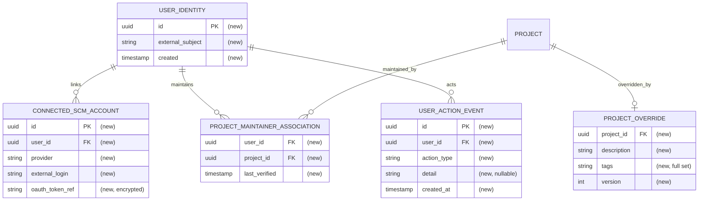

# Spec: User authentication and authorization (first stage)

## 1. Goal
Introduce a unified klibs.io user identity so that a verified GitHub maintainer can sign in, have their maintained indexed projects associated automatically, and self-serve edit those projects' description and tags — with edits persisted as klibs.io overrides. First stage, backend + API contract only.

## 2. Problem
- Project information (description, tags) can only be changed by klibs.io admins via manual updates; there is no user identity or authentication at all.
- **Library authors/maintainers** must file a request and wait for an admin to correct their own project's info.
- **Library users** cannot authenticate, blocking any future community engagement — the identity foundation is missing.

## 3. User scenarios & acceptance
### Scenario 1 — `Sign in and connect GitHub` (P1)
- **Given:** an anonymous visitor
- **When:** they authenticate via JetBrains Account and connect a GitHub account, **or** authenticate with GitHub only
- **Then:** they have an authenticated klibs.io identity with a linked GitHub account
- **Independent test:** run the auth flow with a test identity; assert an identity exists and the GitHub link is recorded — *satisfies PRESPEC-SC-01*

### Scenario 2 — `Automatic project association` (P1)
- **Given:** an authenticated user whose connected GitHub account holds *Maintain* on repo R, where R is an indexed klibs.io project
- **When:** association runs (at login) or the user triggers a refresh
- **Then:** project R appears in the user's maintained-projects list with no manual step
- **Independent test:** seed an indexed project mapped to R; grant test identity Maintain; assert association — *satisfies PRESPEC-SC-02*

### Scenario 3 — `Maintainer edits description and tags` (P1)
- **Given:** an authenticated maintainer of associated project R with **current** Maintain permission
- **When:** they replace R's description and replace R's full tag set (edit form seeded with the current effective values), then save
- **Then:** the saved description and the saved tag set are shown on the project page and in search results
- **Independent test:** perform edit via API; assert override is reflected on project + search read — *satisfies PRESPEC-SC-03*

### Scenario 4 — `Edit blocked without current permission` (P1)
- **Given:** a user who does not currently hold Maintain on R (never had it, or lost it since association), or a moment when GitHub cannot confirm permission
- **When:** they attempt to update R
- **Then:** the update is rejected and R is unchanged (fail closed)
- **Independent test:** attempt edit as non-maintainer, as a revoked maintainer, and with the GitHub check unavailable; assert all rejected and R unchanged — *satisfies PRESPEC-SC-04*

### Scenario 5 — `Override survives re-indexing` (P1)
- **Given:** project R has a maintainer's description override and tag override
- **When:** the indexing/import pipeline re-runs
- **Then:** the description override and the tag override remain unchanged
- **Independent test:** apply override, run import with different upstream values, assert override preserved — *satisfies PRESPEC-SC-05*

### Scenario 6 — `Concurrent edit is not silently clobbered` (P2)
- **Given:** two maintainers open R's edit form at the same version; one saves
- **When:** the second saves based on the now-stale version
- **Then:** the second save is rejected (stale) rather than silently overwriting the first
- **Independent test:** two edits from the same base version; assert the second is rejected and must reload

### Edge cases
- Permission revoked **between** page load and save → save rejected (permission checked at edit time, not page load).
- User has Maintain on a repo that is **not** indexed → no association surfaces.
- Upstream description changes after an override exists → override still wins (PRESPEC-SC-05).
- AI discovers a new tag after a tag override exists → new tag does **not** appear (the tag override is frozen, like the description).

## 4. Functional requirements
*Observable contracts only. Every "how" is in §8.*

- **FR-001:** System MUST let a user authenticate via JetBrains Account, and MUST let a user authenticate with GitHub only. *(PRESPEC-SC-01)*
- **FR-002:** System MUST let an authenticated user connect a GitHub account to their identity. *(PRESPEC-SC-01)*
- **FR-003:** System MUST automatically associate to a user every indexed project for which that user currently holds GitHub *Maintain* permission, with no manual action. *(PRESPEC-SC-02)*
- **FR-004:** An authenticated maintainer MUST be able to replace an associated project's description and its full tag set; the saved description and tag set MUST be reflected on the project page and in search results. *(PRESPEC-SC-03)*
- **FR-005:** System MUST reject any update from a caller whose **current** GitHub *Maintain* permission on that project's repo is not positively confirmed at edit time — including a caller who lost the permission, and including the case where the permission cannot be verified — and MUST leave the project unchanged. *(PRESPEC-SC-04)*
- **FR-006:** A maintainer's description override and tag override MUST persist and MUST NOT be overwritten by subsequent imports/re-indexing. *(PRESPEC-SC-05)*
- **FR-007:** A save based on a stale version of a project MUST be rejected rather than silently overwriting a concurrent change. *(derived — data integrity)*
- **FR-008:** System MUST let an authenticated user retrieve the list of projects they currently maintain, each entry linking to that project's klibs.io page. *(derived from PRESPEC-SC-02/03 — realization detail)*
- **FR-009:** System MUST let an authenticated user trigger an on-demand refresh of their maintained-projects associations. *(derived — keeps PRESPEC-SC-02 associations current)*
- **FR-010:** System MUST expose the list of connected maintainers. *(PRESPEC-SC-06)*
- **FR-011:** System MUST record user-action events — at minimum LOGIN, LOGOUT, GITHUB_CONNECT, ASSOCIATE, REFRESH, EDIT — as an append-only log capturing actor, action, optional target, and timestamp only (no content values). *(observability; enables PRESPEC-SC-07)*
- **FR-012:** System MUST make identifiable, from the action log, maintainers exceeding two LOGIN events within a rolling 30-day window. *(PRESPEC-SC-07)*

## 5. Non-functional requirements
- **External rate limits:** the edit-time permission check (FR-005) and on-demand refresh (FR-009) use the **user's own GitHub OAuth token** (~5,000 req/hr per user), so per-edit/refresh checks consume the user's budget, **not** klibs' shared app/IP budget. Interactive volume is far below the limit; if the limit is hit or GitHub errors/times out, the check **fails closed** (deny edit / report refresh failure, ask to retry).
- **Security:** New authentication boundary. Edit endpoints MUST require an authenticated identity AND a live current-Maintain confirmation. klibs stores per-user GitHub OAuth tokens — MUST be encrypted at rest, minimum scope needed to read repo permission, and revocable. Anonymous callers MUST NOT reach edit endpoints.
- **Observability:** append-only action log (FR-011) backs debugging and the SC-07 login metric; metrics backing FR-010 (connected-maintainer list); logs for edit attempts (allow/deny + reason, incl. fail-closed).
- **Concurrency:** association (at login / on refresh) MUST be idempotent; edits use optimistic locking (§8).

## 6. Out of scope
- Liking libraries and submitting reports (community engagement).
- Author/organization discovery pages (KTL-2039); custom org display names & branding (KTL-2387).
- GitLab and other source-control providers; a general provider-extensible auth abstraction.
- **Versioned content edit-history** (storing old/new description/tag values for recovery or rollback) and **change notifications** — good future increments (candidates for a follow-up prespec), not this stage. *(The append-only action/event log of FR-011 — who/what/when, no content — is in scope and is a different thing.)*
- Any klibs-internal role hierarchy or Admin/owner-only restriction — authorization is delegated to GitHub *Maintain* (§8).
- **Frontend implementation** — the `klibs-frontend` React work is tracked separately; this spec defines only the API/frontend contract.

## 7. Klibs.io technical surface
- **Modules touched:** **new `core/identity`** (owns `UserIdentity`, `ConnectedScmAccount`, `ProjectMaintainerAssociation`, `UserActionEvent`; registered in `project.yaml`); **`core/project`** (owns `ProjectOverride`); **`integrations/github`** (`viewerPermission` query + user-OAuth-token handling); **`app`** (Spring Security, JetBrains Account/Hub + GitHub OAuth client config, callback routing); **`core/search`** (override-aware `project_index`).
- **Database:** new tables for the identity module + `ProjectOverride`; additive-only migration under `app/src/main/resources/db/migration/2026-Q3/`. New-table PKs follow the recent convention (UUID, cf. `user_request_issue`). No backfill (net-new).
- **Persistence style:** JPA (project is JPA-first; match `core/project`).
- **Search / materialized views:** `project_index` MUST resolve the **effective** description/tags (override wins over imported values) so search reflects maintainer edits (FR-004); refresh MUST NOT clobber a maintainer's override (FR-006).
- **External integrations:** GitHub — OAuth (connect) + GraphQL `viewerPermission` read (per-edit + at association/refresh) via the user's token. JetBrains Account / Hub — OIDC/OAuth identity.
- **Scheduled jobs:** association recomputed at login and on user-triggered refresh (no global scan); re-checked live at edit time. No new `@Scheduled` required in this stage.
- **Configuration:** new `klibs.*` properties for JetBrains Account/Hub client and GitHub OAuth client (id/secret/callback). Feature-flag toggle recommended for staged rollout.
- **API surface:** new auth endpoints (login/callback/connect); `GET` my maintained projects (FR-008); `POST` refresh my associations (FR-009); edit endpoint(s) for description/tags (`409` on stale save); read for connected maintainers (FR-010). OpenAPI documented. No breaking change to existing public reads.
- **Frontend contract:** `klibs-frontend` must add sign-in, GitHub-connect, a maintained-projects list (each entry linking to the project page) with a "refresh" action, an edit UI gated on association + current permission (handling `409` reload-and-reapply, tag/description fields seeded with current effective values), and override-aware display. Specified here; implemented separately.

## 8. Design decisions

### Decision — Identity provider
- **Choice:** use **JetBrains Account (backed by JetBrains Hub)** for identity and GitHub account linking, rather than custom OAuth.
- **Why:** Hub reportedly provides OAuth providers, account linking, and a permission model out of the box.
- **Rejected:** custom in-house OAuth/session stack — more to build/maintain.
- **Spike before committing:** confirm which capabilities Hub actually exposes to klibs.io (GitHub connection, multi-provider auth, account linking). *(prespec §3 spike)*

### Decision — Permission source & detection
- **Choice:** check permission with the **user's own GitHub OAuth token** via GraphQL `repository.viewerPermission`; treat `MAINTAIN` or higher as authorized.
- **Why:** the app/PAT token can't read collaborator permissions on repos klibs doesn't admin; the user token is accurate and uses the user's private rate budget. `viewerPermission` is a single typed field matching FR-005.
- **Spike:** measure per-edit call cost. *(prespec §3 spike)*

### Decision — Edit-time check (strict, fail closed)
- **Choice:** re-validate current Maintain permission **live on every edit**; deny if it cannot be positively confirmed (rate limit, error, revoked).
- **Why:** prespec explicitly traded extra API calls for currency; SC-04 requires "verified at edit time." A TTL cache would reintroduce the stale-permission hole SC-04 closes.

### Decision — Override model (full replace, always frozen)
- **Choice:** `ProjectOverride` stores `description` (full replace, nullable) and `tags` (the full replacement set). Once set, both are **always frozen** — the override wins and the import/AI pipeline stops contributing to that field, exactly like the existing description behavior. The edit form is **seeded with the current effective description and tags** so the maintainer edits from current state rather than a blank.
- **Why:** consistency with the already-frozen description; drops the unstable freeze/delta logic in favour of one simple mental model (what you save is what shows). Stored in `core/project` so search/project reads resolve it without crossing modules.

### Decision — Association timing & refresh
- **Choice:** compute/refresh associations at login and on a user-triggered on-demand refresh; re-check live at edit time.
- **Rejected:** periodic global scan of all users×repos — higher API cost.

### Decision — Concurrency control
- **Choice:** JPA `@Version` optimistic locking on the edited entity; a stale save returns `409` (FR-007).
- **Why:** idiomatic and nearly free in a JPA-first codebase; prevents silently clobbering a co-maintainer's correction.

### Decision — User-action event log
- **Choice:** append-only `UserActionEvent` table in `core/identity` recording actor, action type, optional target ref, and timestamp — **events only, no content values**. SC-07 is computed as a count of LOGIN events over a rolling 30-day window; login tracking lives here, **not** as a field on `UserIdentity`.
- **Why:** normalizes login history out of the user row (a "list of logins" doesn't belong on the identity), gives a single observability surface for debugging, and cleanly implements SC-07. Deliberately excludes content diffs so it stays an event log, not the deferred content edit-history.

### Decision — Authorization bar (no klibs role hierarchy)
- **Choice:** any holder of **current GitHub Maintain** may edit; klibs adds no internal roles.
- **Why:** trust is delegated to GitHub — the repo owner already granted Maintain (a powerful role) on GitHub itself. Recovery from a bad edit is a future concern (history), not a stage-1 power hierarchy.

## 9. Key entities
- **UserIdentity:** the klibs.io account (JetBrains Account subject). Fields: id (UUID), external subject id, created. Created on first sign-in. (No login tracking here — see `UserActionEvent`.)
- **ConnectedScmAccount:** an SCM account linked to a UserIdentity. Fields: id, user id (FK), provider (GitHub), external login/id, encrypted OAuth token reference. GitHub first; many-per-user later.
- **ProjectMaintainerAssociation:** UserIdentity ↔ Project where the user maintains the repo. Fields: user id (FK), project id (FK), last-verified. Idempotent.
- **ProjectOverride:** maintainer edits for a Project. Fields: project id (FK), description (nullable), tags (full replacement set), edited-by (FK), edited-at, version (`@Version`).
- **UserActionEvent:** append-only record of a user action. Fields: id (UUID), user id (FK), action type (LOGIN / LOGOUT / GITHUB_CONNECT / ASSOCIATE / REFRESH / EDIT), detail (nullable — e.g. provider for LOGIN, project id for EDIT/REFRESH, count for ASSOCIATE), created-at. No content values.

## 10. Database schema diagram

## 11. Test strategy
- **Unit:** permission decision (current Maintain → allow; else / unverifiable → deny, fail closed); effective description/tags resolution (override wins over imported values).
- **DB-integration (`BaseUnitWithDbLayerTest`):** association idempotency; description + tag override survive import; `@Version` stale-save rejection; SC-07 login count derived from `UserActionEvent`. `@Sql` seeds per method.
- **Web / smoke (`SmokeTestBase`):** edit endpoint requires auth + current permission (allow/deny/unverifiable paths); `409` on stale save; maintained-projects list read; on-demand refresh; connected-maintainers read.
- **Reviewer-only — manual / staging:** full JetBrains Account + GitHub OAuth round-trip on `klibs-features` / `klibs-stage`; verify search reflects an override.

## 12. Assumptions
- Indexed repos can be matched to a GitHub repo well enough to run per-user permission checks.
- JetBrains Account/Hub is the sanctioned identity provider and available to klibs.io.
- Tags are treated as a **free-form set**, saved as a full replacement set; if a controlled vocabulary/category constraint exists, saved values are restricted to the allowed set — confirm during `/plan`.
- Interactive edit/refresh volume stays well within per-user GitHub rate budgets.

## 13. References
- Prespec: `docs/specs/users-authorizations/prespec.md`
- KTL-2853 (source ticket); original request: `https://github.com/JetBrains/klibs-io-issue-management/issues/112`
- Later stages: KTL-2039 (author/org discovery), KTL-2387 (custom org display names)
